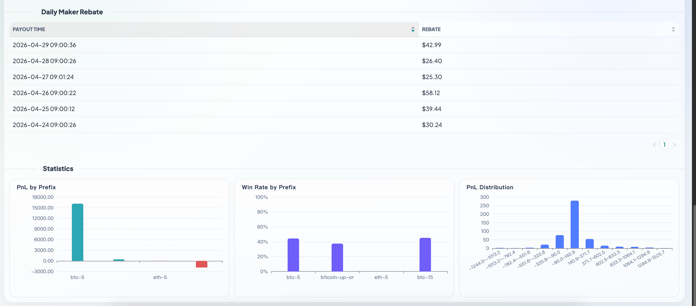

# analysis-poly

**Real Profit (Fee-Excluded View)**




中文说明见：[README_zh.md](README_zh.md)

Polymarket market PnL analyzer with a web UI.

## Scope (Important)

- The dashboard discovers markets from Polymarket user activity within the selected time range, then replays the matched markets.
- It is intended for Polymarket market analysis in general, including but not limited to crypto markets.
- Main purpose: quantify and visualize realized PnL, fee impact, market-level performance, and `Net PnL` vs `No-Fee PnL`.

## Requirements

- Python `3.11+` (recommended: `3.11`)
- `uv` package manager is optional for local development

## Quick Start

```bash
pip install analysis-poly
analysis-poly-server --host 127.0.0.1 --port 8000
```

Open [http://localhost:8000](http://localhost:8000).

## Local Install From Source

```bash
uv pip install .
# or
pip install .
```

Then start the web server with the same one-line command:

```bash
analysis-poly-server --host 127.0.0.1 --port 8000
```

For source checkout development, this also works:

```bash
uv sync
uv run python main.py
```

## CLI Open + Auto Start

Use a standalone script to start server, open browser, and pass params in URL.

```bash
uv run -m analysis_poly.open_with_params \
  --address 0xabc \
  --keywords updown,15m \
  --start-time "2026-03-01 00:00" \
  --end-time "2026-03-02 00:00" \
  --concurrency 8
```

Frontend will read query params, fill form fields, and auto start the run.

## First Clone

`analysis_poly/static/dist` is committed in the repository, so first startup does not require front-end build.

If you modify `frontend/src`, rebuild assets:

```bash
npm install
npm run build
```

## API

- `POST /api/runs`
- `GET /api/runs/{run_id}/stream` (SSE)
- `POST /api/runs/{run_id}/stop`
- `GET /api/runs/{run_id}/result`
- `GET /api/runs/{run_id}/state`

## Test

```bash
uv run pytest
```

## Frontend

- Source: `frontend/src`
- Build output: `analysis_poly/static/dist/app.js` and `analysis_poly/static/dist/app.css`
