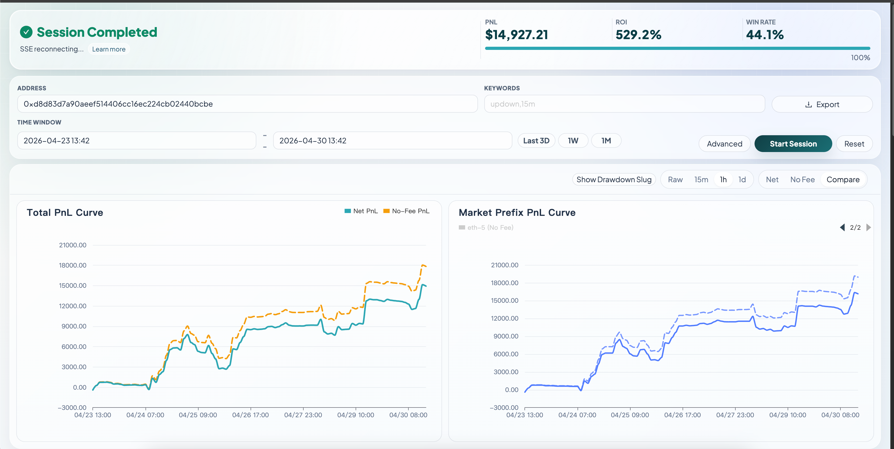
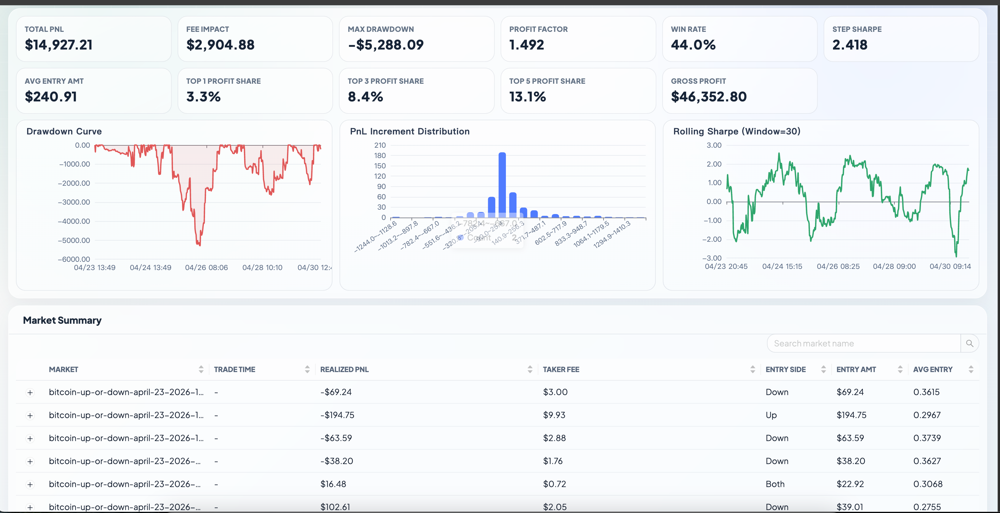

# analysis-poly

**真实利润（去除手续费影响）**




Polymarket 真实利润分析 Web 工具。

## 适用范围（重要）

- 本工具主要针对 Polymarket crypto `updown` 且含 taker 手续费的市场，重点是 `5m` 和 `15m`。
- **不**是一个覆盖所有 Polymarket 市场类型的通用 PnL 引擎。
- 主要目的：量化并可视化手续费对真实盈利的影响（`Net PnL` 对比 `No-Fee PnL`）。

## 启动

```bash
uv sync
uv run python main.py
```

打开 [http://localhost:8000](http://localhost:8000)。

## 命令行打开并自动启动

使用独立脚本启动服务、打开浏览器，并把参数放进 URL：

```bash
uv run python open_with_params.py \
  --address 0xabc \
  --symbols btc,eth \
  --intervals 5,15 \
  --start-time "2026-03-01 00:00" \
  --end-time "2026-03-02 00:00" \
  --concurrency 8
```

前端会读取 URL 参数，自动填充表单并直接启动。

## 首次拉取说明

仓库已提交 `static/dist` 构建产物，首次启动不需要先构建前端。

如果你修改了 `frontend/src`，需要重新构建：

```bash
npm install
npm run build
```

## API

- `POST /api/runs`
- `GET /api/runs/{run_id}/stream`（SSE）
- `POST /api/runs/{run_id}/stop`
- `GET /api/runs/{run_id}/result`
- `GET /api/runs/{run_id}/state`

## 测试

```bash
uv run pytest
```

## 前端

- 源码：`frontend/src`
- 构建产物：`static/dist/app.js`、`static/dist/app.css`
